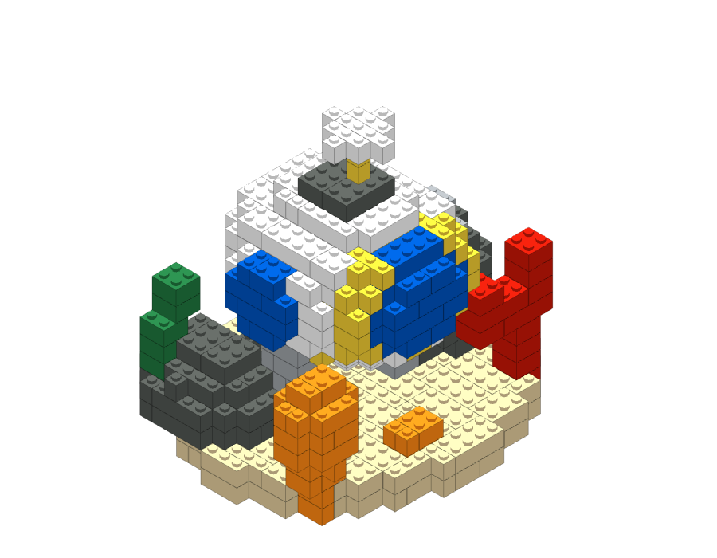
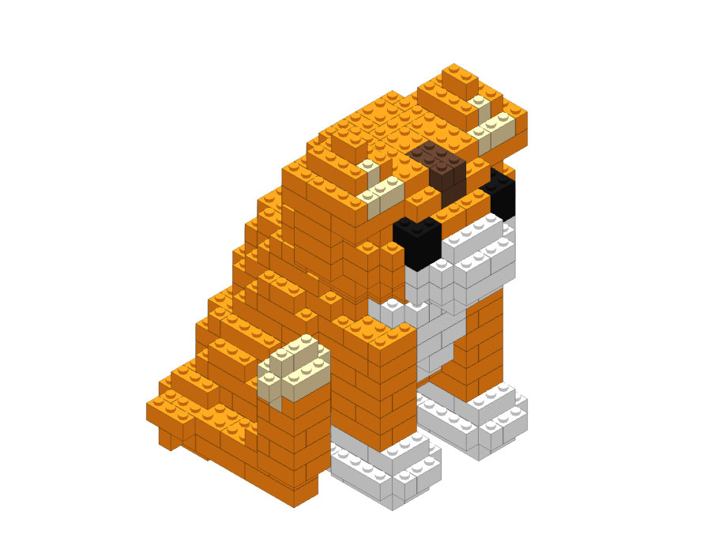
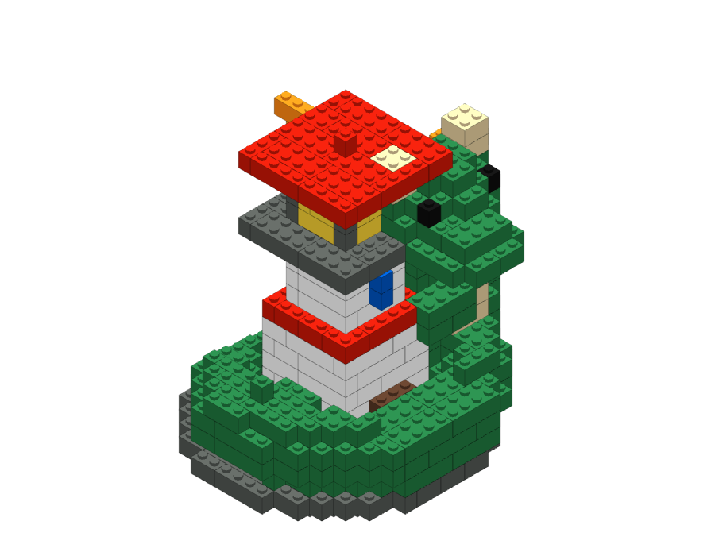

# Blawx

Blawx turns a short prompt into a rotatable, brick-built model, then works
backward into ordinary bricks and a draft construction guide.

<p align="center">
  
  
  
</p>

Most generative 3D demos stop at the render. Blawx keeps going: it packs the
voxel shape into familiar rectangular bricks, plans an assembly order, and lays
the result out like a tiny instruction booklet. Six saved sets are included, so
you can explore the whole experience without generating anything first.

## What it does

- Generates full-3D voxel models from text prompts through a local Codex CLI
  workflow.
- Converts voxels into ordinary rectangular brick placements.
- Lets you rotate and compare the raw, packed, and adjusted models.
- Builds a scrolling guide with numbered steps and an illustrated parts list.
- Keeps unsupported or unresolved operations visible instead of quietly hiding
  them.

The pipeline is roughly:

`prompt → voxel model → brick packing → assembly plan → instructions`

## Run it locally

Blawx is tested with Node.js 22.

```sh
./setup.sh
npm run dev
```

Open <http://127.0.0.1:5178>. The included sets work immediately and do not use
a model call.

To generate a new set, install and sign in to the
[Codex CLI](https://developers.openai.com/codex/cli/), then submit a prompt in
the app. Generation uses your local ChatGPT authentication; there is no paid API
fallback. Prompts and results are stored in private application data outside the
repository.

The generation server is intended for local use only. A static build includes
the viewer and saved sets, but not the prompt-generation backend.

## Develop

```sh
npm test          # run the test suite
npm run build     # build the static site
npm run preview   # preview the static build
```

Tests and builds use saved fixtures and provider doubles; they do not
intentionally make model-provider calls.

Contributions are welcome. Please keep provider calls out of automated tests,
preserve unresolved construction states, and run both `npm test` and
`npm run build` before opening a pull request.

## Prototype status

Blawx is a technology demo, not a physical buildability checker. A completed
guide does not prove structural strength, stability, parts availability, or safe
construction. The `Draft` and unresolved-step markings are intentional.

## License

MIT. See [LICENSE](LICENSE) and
[THIRD_PARTY_NOTICES.md](THIRD_PARTY_NOTICES.md).

Blawx is an independent project and is not affiliated with or endorsed by the
LEGO Group. LEGO is a trademark of the LEGO Group.
